# Project External Resources

## 🎨 Figma Prototype

## Kiosk Interface in case of Success
[Click here](https://www.figma.com/proto/I3SqsK6MvMDjZkn7mkqLnU/interfaz-kiosko?node-id=58-543&p=f&t=oxBD8jshv7nlKSfw-1&scaling=min-zoom&content-scaling=fixed&page-id=58%3A207&starting-point-node-id=58%3A543)  

The touchscreen kiosk welcomes the user to start, then lets them select a service area and choose to create or retrieve a turn. Depending on the setup, they may enter personal info or generate a turn directly. Finally, the system shows the turn number, wait time, and a QR code for tracking.  

  

If a customer loses their turn, they can tap “I lost my turn”, enter the lost turn ID, and press “Request”. If the conditions are met, the system confirms the recovered turn, shows the new turn number, estimated wait time, and a QR code for tracking.  

  

## Kiosk Interface in case of Failure
[Click here](https://www.figma.com/proto/I3SqsK6MvMDjZkn7mkqLnU/interfaz-kiosko?node-id=72-218&p=f&t=eP7yZHYaWutBXm4e-1&scaling=min-zoom&content-scaling=fixed&page-id=72%3A107&starting-point-node-id=72%3A218&show-proto-sidebar=1)  
This flow shows what happens when the user leaves required fields empty during the turn generation or recovery process. After attempting to continue with incomplete information, the system displays an error screen notifying the user that there are empty fields and prompting them to try again.

  
The flow keeps the same for both cases:  

  

  
This screen would be shown:  
  

This flow represents the scenario when the user enters invalid or incorrect information, such as an invalid ID number. When the system detects invalid data, it redirects the user to an error screen that explains the issue and offers an option to re-enter the information correctly.  

  
The flow keeps the same for both cases:  

  

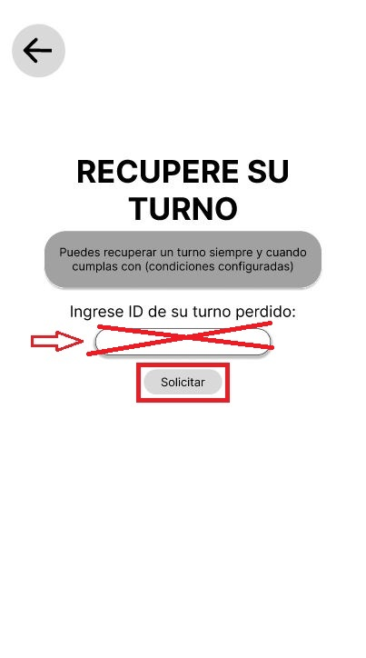  
This screen would be shown:  
  

## Administrator Pannel
[Click here](https://www.figma.com/proto/I3SqsK6MvMDjZkn7mkqLnU/interfaz-kiosko?node-id=182-42&p=f&t=8ZmT78y9XS4Yw5q3-1&scaling=contain&content-scaling=responsive&page-id=86%3A121&starting-point-node-id=182%3A42)  

This page shows the administrator’s desktop software provided with the queue management system. Through this interface, the administrator can fully manage and customize the system according to their needs: they can create and assign branches, kiosks, and screens; configure which advertising content will be displayed on customer-facing TVs; and adjust the kiosk settings to handle turn generation as desired. The software also allows them to add and manage other administrative users, assign roles and permissions, and oversee all queue operations, ensuring that the entire system is tailored to their specific business logic and customer service flow.  
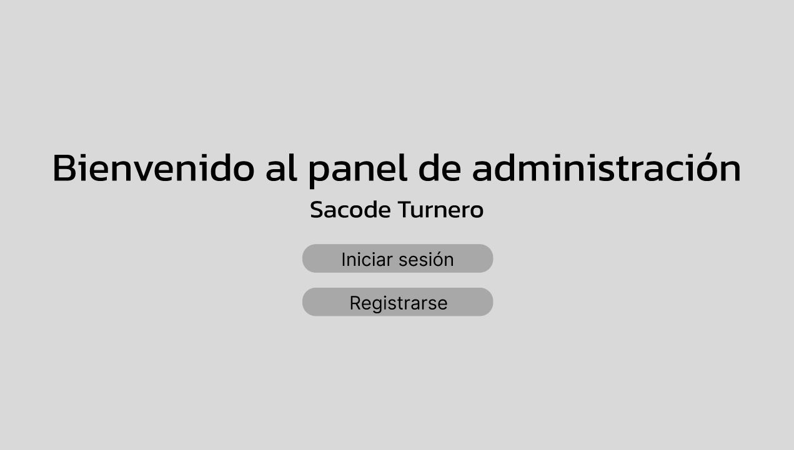
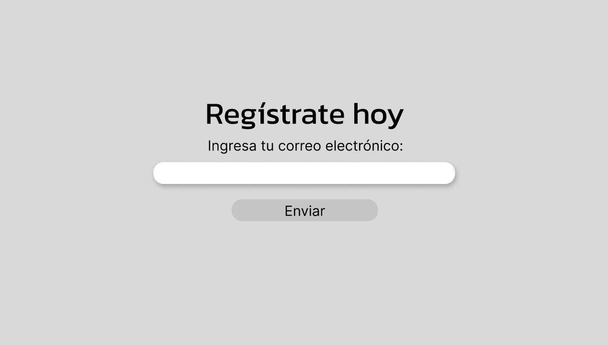
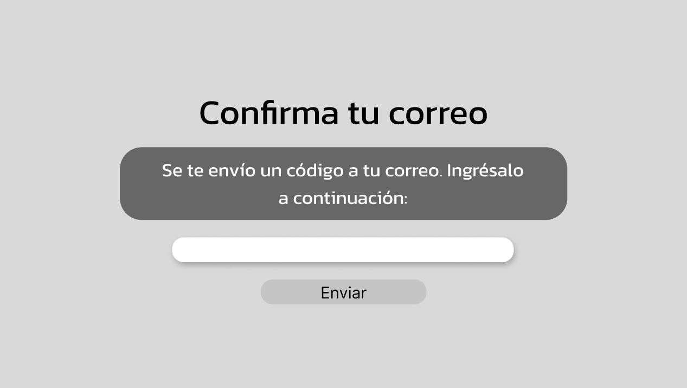
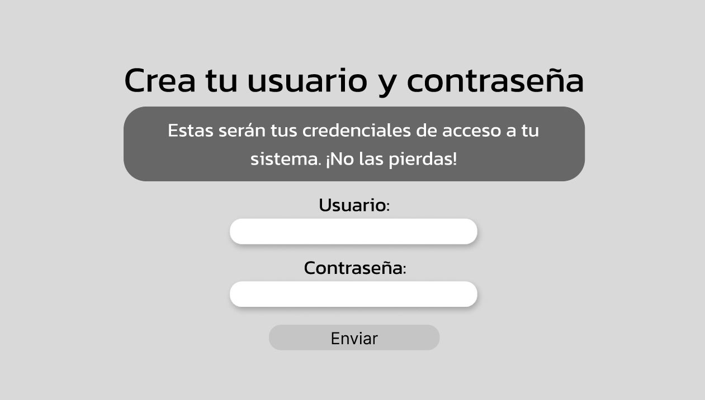
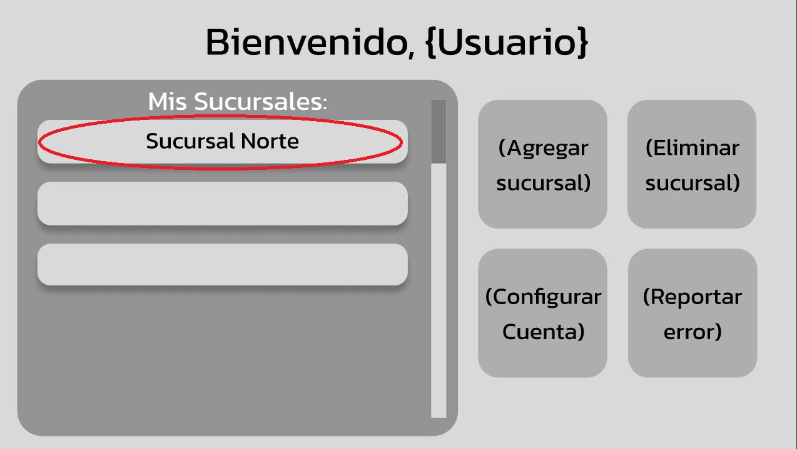  
Here we have three different flows shown, this is the first one for kiosks:  

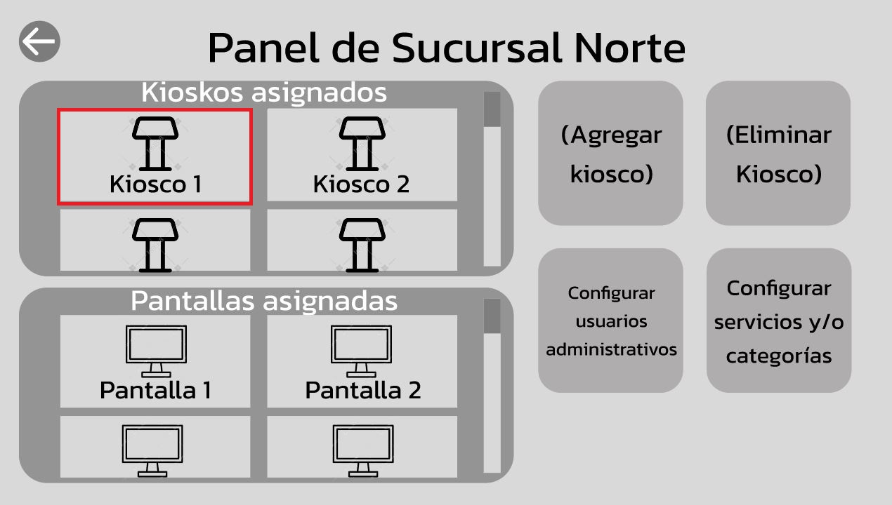
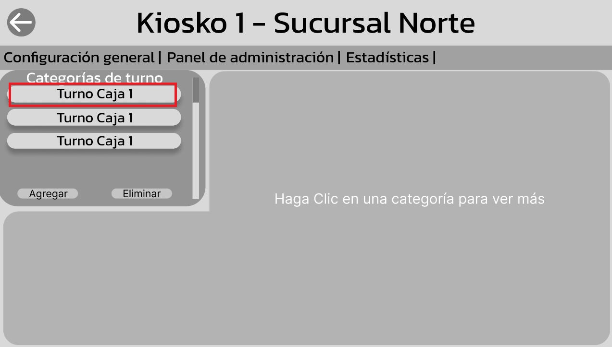
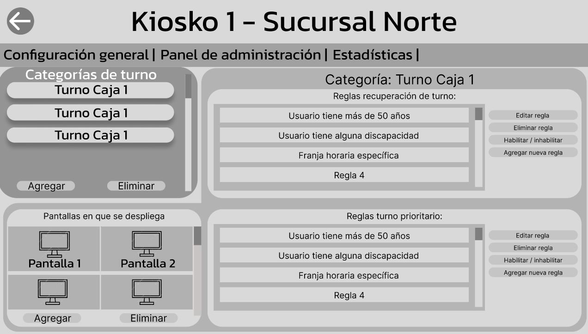  
Then we return to the branch page to see the next flow for screens:  

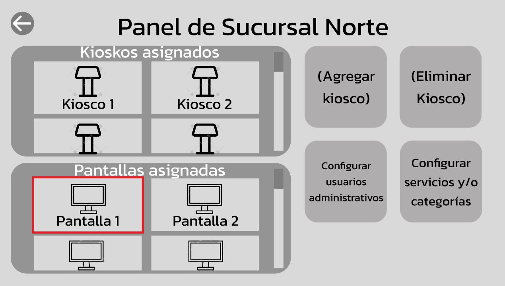
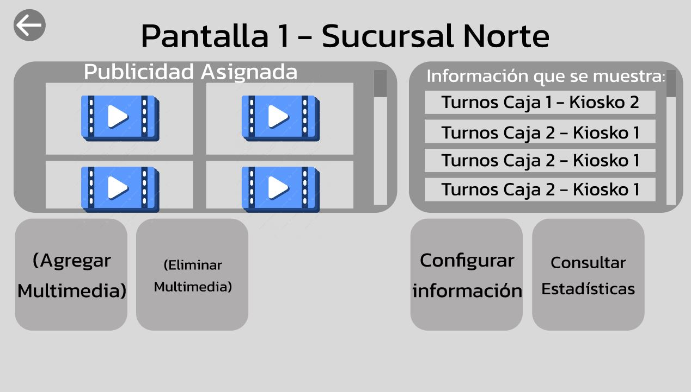  

Then we return to the branch page to see the next flow for administrative users:  
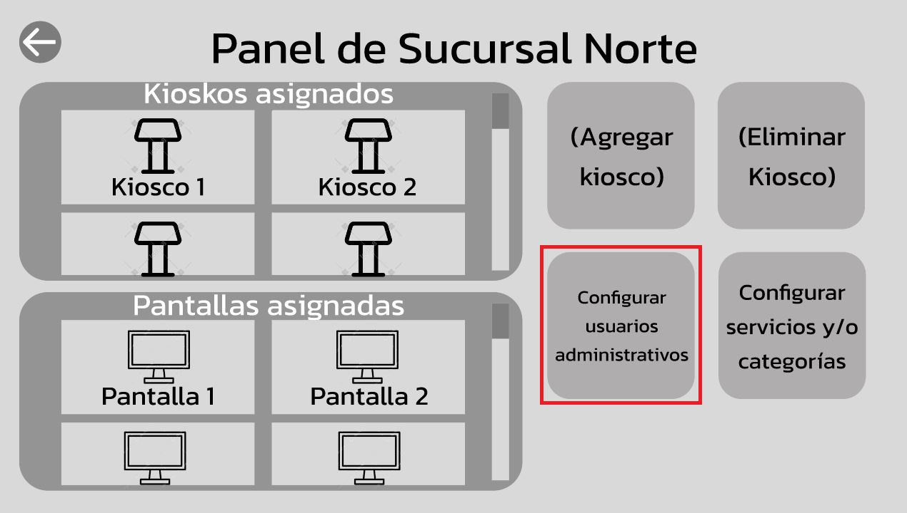
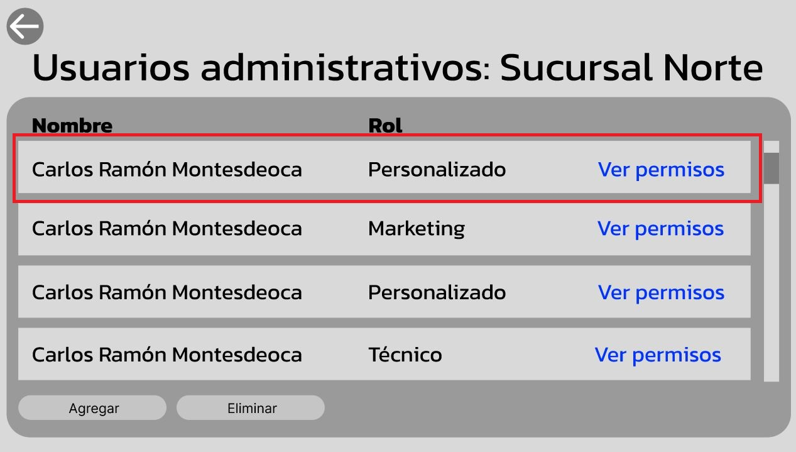
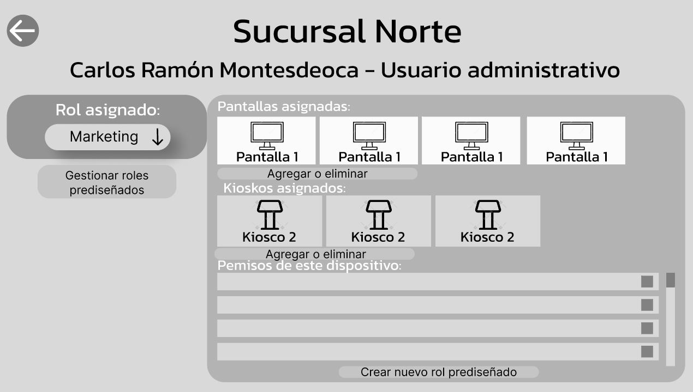  

## TV interface
[Click here](https://www.figma.com/proto/I3SqsK6MvMDjZkn7mkqLnU/interfaz-kiosko?node-id=125-35&p=f&t=nuzWrON6DwYqYt2I-1&scaling=scale-down&content-scaling=fixed&page-id=93%3A9&starting-point-node-id=125%3A35&show-proto-sidebar=1)  

This page shows the TV display used to present the current and upcoming queue numbers to customers, alongside advertising content configured by the administrator.  

  
The screens illustrate different scenarios: one where individual turns are called sequentially,  
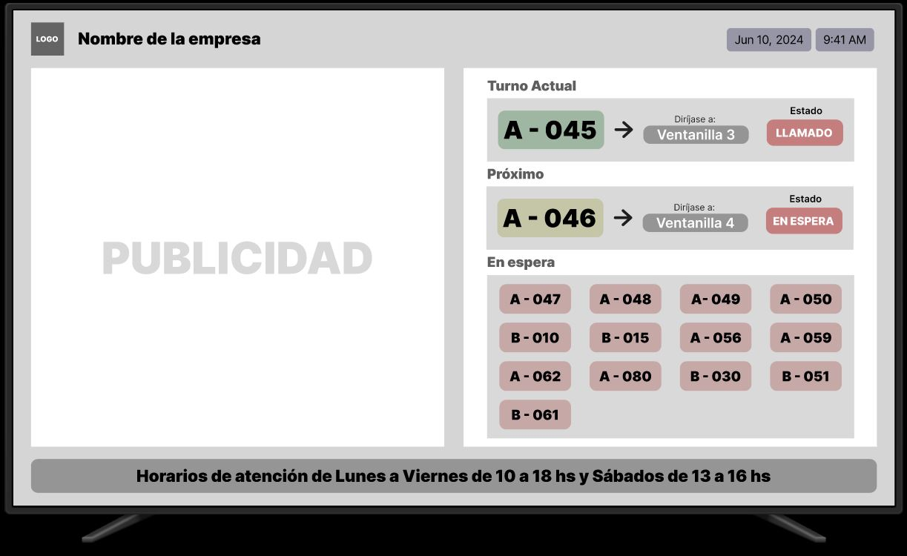  
another where multiple turns are called simultaneously across different areas or categories depending on business logic  
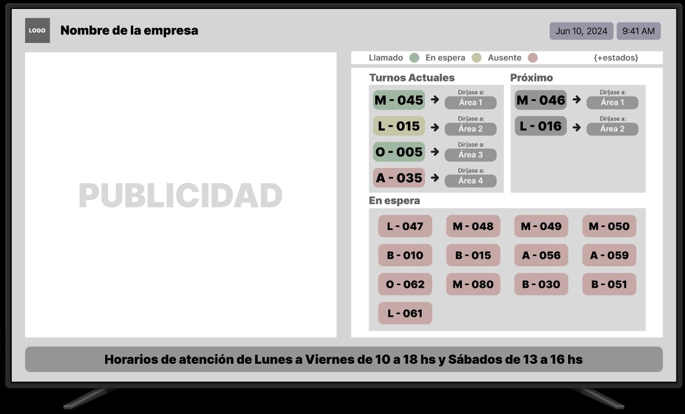  
and an example of a simple error case in which the advertising content fails to load correctly.  
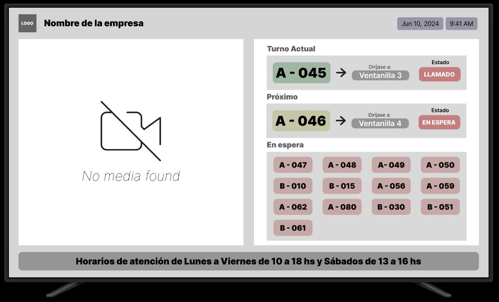  

## User interface QR
[Click here](https://www.figma.com/proto/I3SqsK6MvMDjZkn7mkqLnU/interfaz-kiosko?node-id=164-364&p=f&t=3hRM1usET0jUnCPn-1&scaling=scale-down&content-scaling=fixed&page-id=133%3A122&starting-point-node-id=164%3A364&show-proto-sidebar=1)  
This page shows what a user sees after scanning the QR code printed on their ticket when they take a turn. Through this view, the user can check the real-time status of their queue position at any moment, including dynamic alerts indicating whether their turn is approaching, still has a long wait time, or has already been called but they are late. It also displays an estimated time, the designated area to report to, and a list of helpful reminders to ensure they are prepared when their turn comes up, giving them full control and clear instructions throughout the process.  

