# Project External Resources

## 🎨 Figma Prototype

## Kiosk Interface in case of Success
[Click here](https://www.figma.com/proto/I3SqsK6MvMDjZkn7mkqLnU/interfaz-kiosko?node-id=58-543&p=f&t=oxBD8jshv7nlKSfw-1&scaling=min-zoom&content-scaling=fixed&page-id=58%3A207&starting-point-node-id=58%3A543)  

The touchscreen kiosk welcomes the user to start, then lets them select a service area and choose to create or retrieve a turn. Depending on the setup, they may enter personal info or generate a turn directly. Finally, the system shows the turn number, wait time, and a QR code for tracking.  

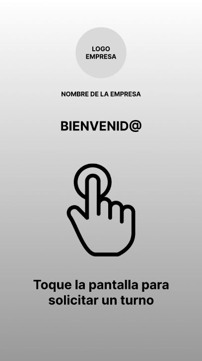
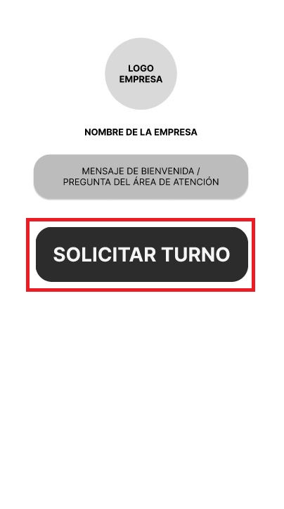
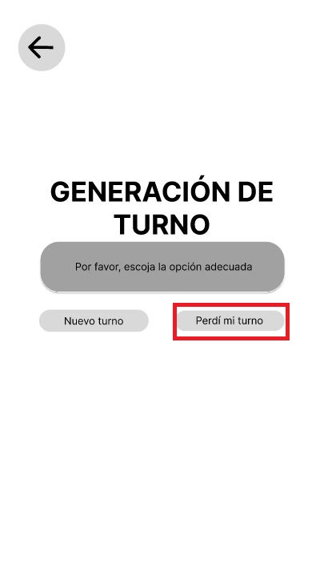
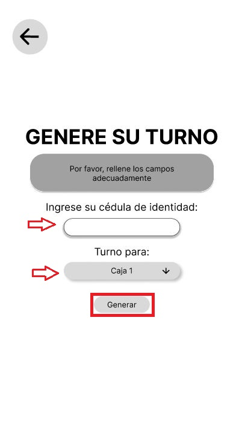
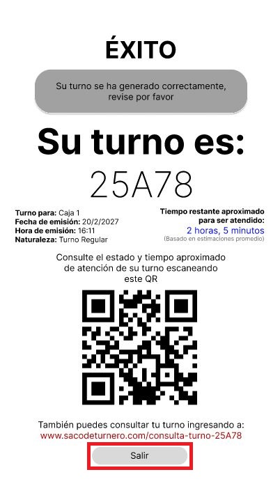  

If a customer loses their turn, they can tap “I lost my turn”, enter the lost turn ID, and press “Request”. If the conditions are met, the system confirms the recovered turn, shows the new turn number, estimated wait time, and a QR code for tracking.  

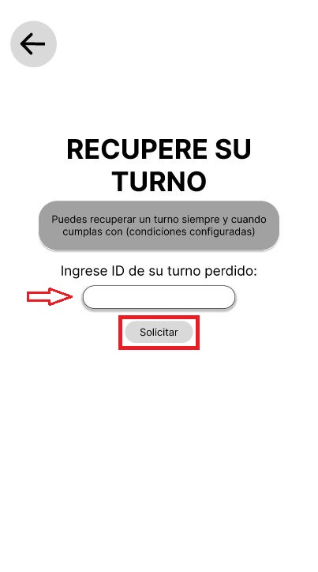
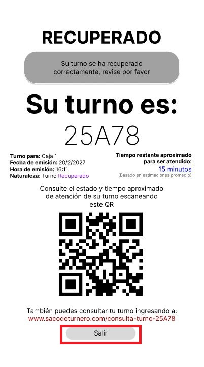  

## Kiosk Interface in case of Failure
[Click here](https://www.figma.com/proto/I3SqsK6MvMDjZkn7mkqLnU/interfaz-kiosko?node-id=72-218&p=f&t=eP7yZHYaWutBXm4e-1&scaling=min-zoom&content-scaling=fixed&page-id=72%3A107&starting-point-node-id=72%3A218&show-proto-sidebar=1)  
This flow shows what happens when the user leaves required fields empty during the turn generation or recovery process. After attempting to continue with incomplete information, the system displays an error screen notifying the user that there are empty fields and prompting them to try again.

  
The flow keeps the same for both cases:  

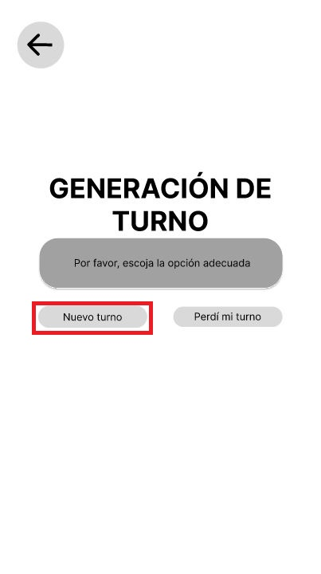
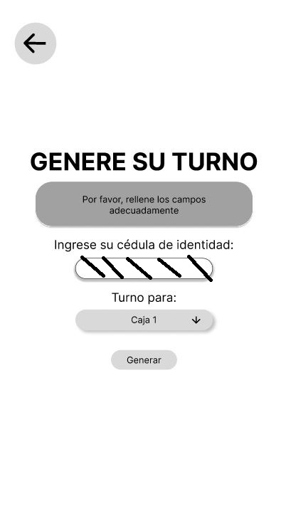  

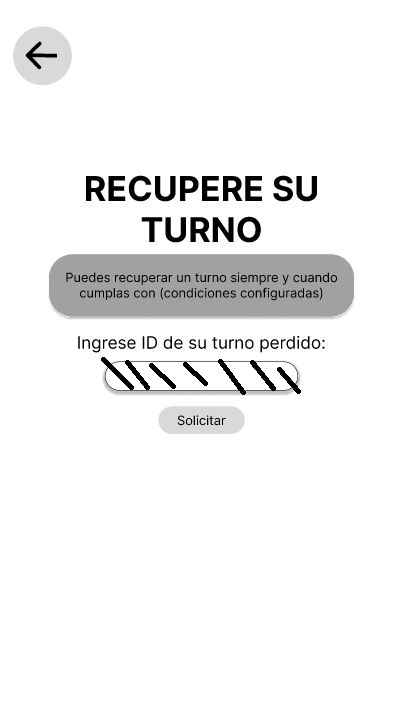  
This screen would be shown:  
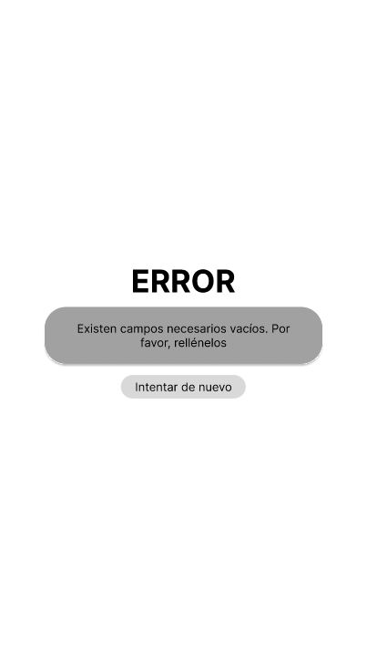  

This flow represents the scenario when the user enters invalid or incorrect information, such as an invalid ID number. When the system detects invalid data, it redirects the user to an error screen that explains the issue and offers an option to re-enter the information correctly.  

  
The flow keeps the same for both cases:  

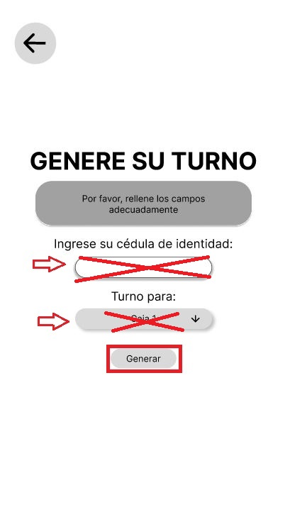  

  
This screen would be shown:  
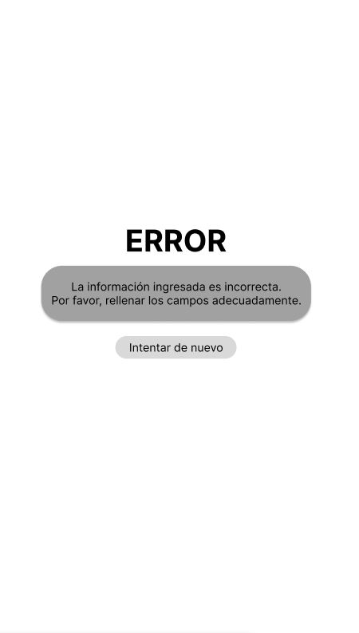  

## Administrator Pannel
[Click here](https://www.figma.com/proto/I3SqsK6MvMDjZkn7mkqLnU/interfaz-kiosko?node-id=182-42&p=f&t=8ZmT78y9XS4Yw5q3-1&scaling=contain&content-scaling=responsive&page-id=86%3A121&starting-point-node-id=182%3A42)

## TV interface
[Click here](https://www.figma.com/proto/I3SqsK6MvMDjZkn7mkqLnU/interfaz-kiosko?node-id=125-35&p=f&t=nuzWrON6DwYqYt2I-1&scaling=scale-down&content-scaling=fixed&page-id=93%3A9&starting-point-node-id=125%3A35&show-proto-sidebar=1)

## User interface QR
[Click here](https://www.figma.com/proto/I3SqsK6MvMDjZkn7mkqLnU/interfaz-kiosko?node-id=164-364&p=f&t=3hRM1usET0jUnCPn-1&scaling=scale-down&content-scaling=fixed&page-id=133%3A122&starting-point-node-id=164%3A364&show-proto-sidebar=1)
